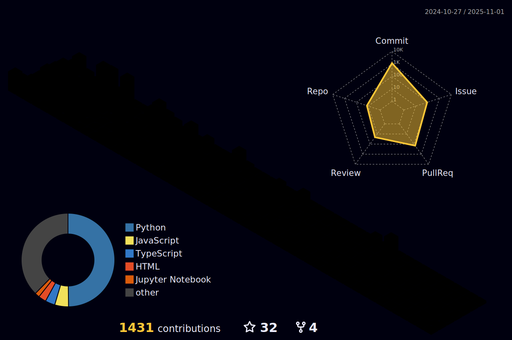

  

  
## ⚾ About me!

  <!-- 소셜 배지들 -->
  
  
  
  
    
   
   
  
  <!-- 헤더 이미지 -->
  

#### 🎙️ Video
> PyCon.KR 2024에서 "인공지능과 파이썬으로 금융 데이터 분석해보기 with 자연어처리 (NLP)" 라는 주제로 진행한 세션 영상입니다.
> 
> 세션 자료: [PyCon Korea 2024 PPT - 인공지능과 파이썬으로 금융 데이터 분석해보기 with 자연어처리 (NLP).pdf](https://github.com/user-attachments/files/18330301/PyCon.Korea.2024.PPT.-.with.NLP.pdf)

  
  [![인공지능과 파이썬으로 금융 데이터 분석해보기 with 자연어처리 (NLP) - 김대현 [PyCon.KR 2024]](https://img.youtube.com/vi/pCO04CtCl6c/0.jpg)](https://www.youtube.com/watch?v=pCO04CtCl6c)

### 🌱 Career

> 🛍️ **Kakaostyle (Zigzag)**  
> 2025.07. ~ Present.  
> Search Recommendation Exhibition Team | Data Quality Manager (Intern)
> 
> 🎓 **Hankuk University of Foreign Studies (HUFS)**  
> 2020.03. ~ Present  
> Major: Computer Engineering | Minor: Data Science  
>
> 🧑‍💻 **Google Developer Groups, GDG Campus Korea**  
> 2025.01. ~ present | Community Organizer
> 
> ⛅️ **KakaoTech Bootcamp 1st (in Pangyo)**  
> 2024.07. ~ 2024.12.  
> Gen AI Process | AI Model & Data Pipeline Construction, API Development
> 
> 🤖 **JRC Company**  
> 2016.12. ~ 2018.07.  
> Robotics Engineer | Arduino, circuit design and fabrication, Part Modeling
---

    <h3>📋 Projects & Research</h3>
    <table>
        <tr>
            <th>Name</th>
            <th>Position & Role</th>
            <th>Duration</th>
            <th>Organizer</th>
        </tr>
        <tr>
          <td>
            <a href="https://github.com/Trinity-goorm" target="_blank">
              "Catch-Ping" 개인 사용자 맞춤형 스마트 다이닝 플랫폼
            </a>
          </td>
          <td>개인 맞춤형 식당 추천시스템 개발 (AI) & Infra 설계, 구축 (AWS)</td>
          <td>2025.01 ~ 2025.04</td>
          <td>goorm (프로펙트 풀스택 프로젝트 과정 1회차)</td>
        </tr>
        </tr>
        <tr>
          <td>
            <a href="https://github.com/KakaoTech-14-All-in-one-move" target="_blank">
              "Pitching" AI 기반 실시간 발표 피드백 & 커뮤니케이션 플랫폼
            </a>
          </td>
          <td>Lead (PM), AI (CV & VLM Prompt Engineering) & Data 처리 파이프라인 구축 및 API 개발</td>
          <td>2024.09 ~ 2024.12</td>
          <td>kakao x Goorm - kakaotech Bootcamp</td>
        </tr>
        <tr>
          <td>
            <a href="https://github.com/Kakaotech-18-Ecommerce" target="_blank">
              "Golla Golla" 개인 맞춤형 E-commerce Platform
            </a>
          </td>
          <td>추천시스템(RecSys) Model 개발 & 검색엔진 및 API 개발</td>
          <td>2024.06 ~ 2024.09</td>
          <td>kakao x Goorm - kakaotech Bootcamp</td>
        </tr>
        <tr>
          <td>
            <a href="https://github.com/Kakao-Groomton-MusicGen" target="_blank">
              "TEMU" 생성형 AI 기반 교육용 동요 제공 서비스
            </a>
          </td>
          <td>Lead, LLM & 노래 생성 모델 API 개발</td>
          <td>2024.09</td>
          <td>kakao x Goorm - kakaotech Bootcamp (해커톤)</td>
        </tr>
        <tr>
          <td>
            <a href="https://github.com/FindAlphaa/Mapping101" target="_blank">
              "Investing Mapping 101" - NLP 기반 투자 지원 플랫폼
            </a>
          </td>
          <td>Prompt Engineering & Dataset 수집 및 처리 파이프라인, FE & UI/UX 개발</td>
          <td>2023.06 ~ 2024.08</td>
          <td>과학기술정보통신부, 한국데이터산업진흥원, 한국외국어대학교</td>
        </tr>
        <tr>
          <td>
            <a href="https://github.com/Daehyun-Bigbread/yyamyyam" target="_blank">
              "Yum yum" AI 기반 식단 관리 서비스
            </a>
          </td>
          <td>AI (CV - 컴퓨터비전) & BE 파이프라인 구축</td>
          <td>2023.12 ~ 2024.02</td>
          <td>[Seoul AI Hub x MODULABS] SW & AI 개발자 양성교육</td>
        </tr>
        <tr>
          <td>Visualization of the Industry Through Keywords & Sensitivity Analysis</td>
          <td>논문 1저자로 발표 (NCAEIC-2023)</td>
          <td>2023.10 ~ 2023.12</td>
          <td>ICT-AES & KSF at Hotel The One, Jeju Island, Korea Republic (Nov.30-Dec.2, 2023)</td>
        </tr>
        <tr>
          <td>Predicting Actual Transaction Prices of Top 5 Korea Apartment Brands Using ML</td>
          <td>부동산 매매 데이터, 경제지표 수집 & One-Hot Encoding 을 이용한 모델 성능 평가</td>
          <td>2023.09 ~ 2023.12</td>
          <td>한국외국어대학교 경상대학, 데이터분석학회 DAT</td>
        </tr>
    </table>

  
<h3>🆠Awards</h3>

  <table>
    <thead>
      <tr>
        <th>Award</th>
        <th>Issued by</th>
        <th>Date</th>
        <th>Details/Location</th>
      </tr>
    </thead>
    <tbody>
      <tr>
        <td>2nd Award (최우수상)</td>
        <td>Kakaotech BootCamp [Kakao Corp. x Goorm]</td>
        <td>2024.12.13</td>
        <td>AWS 부하테스트 대회 토너먼트 </td>
      </tr>
      <tr>
        <td>Grand Award (대상)</td>
        <td>Seoul AI Hub X MODULABS (모두의연구소)</td>
        <td>2024.02.23</td>
        <td>2024 AI/SW Start-up Job Fair</td>
      </tr>
      <tr>
        <td>Best-paper Award (Best 논문상)</td>
        <td>NCAEIC-2023 (ICT-AES, KSF)</td>
        <td>2023.11.30 ~ 2023.12.02</td>
        <td>Hotel The One, Jeju Island, Korea. for "Investing Mapping 101: Visualization of the Industry through Keywords & Sensitivity Analysis"</td>
      </tr>
      <tr>
        <td>Excellence Award (우수상, 3rd)</td>
        <td>HUFS Summer Hackathon (GDSC HUFS & TAB, AI Education Center of HUFS(AI 교육원))</td>
        <td>2024.06.28 ~ 2024.06.29</td>
        <td>2024 HUFS Summer Hackathon</td>
      </tr>
      <tr>
        <td>Capstone Project Research Award (캡스톤 우수상)</td>
        <td>HUFS Data Analysis Academy (DAT), HUFS School of Economics and Business (한곡외국어대학교 경상대학)</td>
        <td>2023.12.11</td>
        <td>Capstone project research recognition</td>
      </tr>
      <tr>
        <td>Bronze Award (4th)</td>
        <td>International Robot Olympiad (IROC-국제로봇올림피아드 위원회)</td>
        <td>2017.08.05 ~ 2017.08.06</td>
        <td>DDC Convention Center, Daejeon, Korea</td>
      </tr>
      <tr>
        <td>Creative Concept Award</td>
        <td>The 4th Australian Robotics Challenge (Griffith University, Google Australia, Australia Robotics Association)</td>
        <td>2017.10.26 ~ 2017.10.27</td>
        <td>Griffith University Gold Coast Campus, Brisbane, Australia</td>
      </tr>
    </tbody>
  </table>

  
<h3> ⭐ Activities</h3>

  

  <table>
    <thead>
      <tr>
        <th>Organization/Team</th>
        <th>Position</th>
        <th>Duration</th>
        <th>Key Activities/Contributions</th>
      </tr>
    </thead>
    <tbody>
      <tr>
        <td>Google Developers Group</td>
        <td>Organizer, Staff</td>
        <td>2024 ~ Present</td>
        <td>GDG Campus Korea Organizer (2025~), GopherCon Korea 2024 Organizer (GDG Golang Korea), Speaker Management</td>
      </tr>
      <tr>
        <td>PyCon 2024</td>
        <td>Speaker</td>
        <td>2024.10</td>
        <td>Topic: "Analyzing Financial Data with AI & Python using NLP"</td>
      </tr>
      <tr>
        <td>YOUTHCON'24</td>
        <td>Speaker</td>
        <td>2024.08</td>
        <td>Topic: "Growth from Reckless Challenges"</td>
      </tr>
      <tr>
        <td>ICT-Advanced Engineering Society (ICT-AES)</td>
        <td>Participant (Member)</td>
        <td>2023.12</td>
        <td>National Conference on Advanced Engineering and ICT-Convergence (NCAEIC-2023)</td>
      </tr>
      <tr>
        <td>SW/AI University Global Talent Training Program</td>
        <td>Participant</td>
        <td>2023.11</td>
        <td>Training programs in Nanyang Technical University, National University of Singapore, Hanoi University of Science and Technology</td>
      </tr>
      <tr>
        <td>DAT (Data Analysis Academy)</td>
        <td>ML Team Member</td>
        <td>2023.09 ~ 2023.12</td>
        <td>Capstone project: Predicting transaction prices of top 5 Korean apartment brands using ML</td>
      </tr>
      <tr>
        <td>Team FindAlpha</td>
        <td>Member</td>
        <td>2023.06 ~ 2023.08</td>
        <td>Deep learning NLP projects, participated in "Mapping 101 Service" development with Ministry of Science, ICT & Kdata</td>
      </tr>
      <tr>
        <td>Passion & Pioneer Academic Society of Computer Engineering (PnP)</td>
        <td>Organizer</td>
        <td>2020 ~ Present</td>
        <td> Cheif Operating Officer (2024.03 ~ present), Lead AI study team (2023 ~ 2024.02), AI & DS study (2020 ~ 2021)</td>
      </tr>
    </tbody>
  </table>

  
<h3>📠Papers</h3>

  - "Investing Mapping 101: Visualization of the Industry through Keywords & Sensitivity Analysis" - National Conference on Advanced Engineering and ICT-Convergence 2023 (NCAEIC-2023), organized by ICT-AES and KSF at Hotel The One, Jeju Island, Korea Republic (Nov. 30 - Dec. 2, 2023)
  - "Predicting Actual Transaction Prices of Top 5 Korea Apartment Brands Using ML" - Conference Capstone Project Presentation, organized by HUFS Data Analysis Academy DAT, HUFS School of Economics and Business (Dec. 07, 2023)

---

### 🖥️ Skills

   <table>
        <thead>
            <tr>
                <th>Category</th>
                <th>Tech</th>
            </tr>
        </thead>
        <tbody>
            <tr>
                <td>AI & BE</td>
                <td>
                    
                    
                    
                    
                    
                    
                    
                    
                    
                   
                    
                    
                    
                </td>
            </tr>
            <tr>
                <td>Cloud & Infra</td>
                <td>
                    
                    
                    
                    
                    
                    
                    
                    
                    
                    
                    
                    
                    
                    
                    
                </td>
            </tr>
            <tr>
                <td>etc</td>
                <td>
                    
                    
                    
                    
                    
                    
                    
                    
                    
                    
                </td>
            </tr>
        </tbody>
    </table>

---

### 🌱 Github Stats  

  

    
    
  

 

  

    
  

<!--

**Daehyun-Bigbread/Daehyun-Bigbread** is a ✨ _special_ ✨ repository because its `README.md` (this file) appears on your GitHub profile.

Here are some ideas to get you started:

- 🔭 I’m currently working on ...
- 🌱 I’m currently learning ...
- 👯 I’m looking to collaborate on ...
- 🤔 I’m looking for help with ...
- 💬 Ask me about ...
- 📫 How to reach me: ...
- 😄 Pronouns: ...
- ⚡ Fun fact: ...
-->
